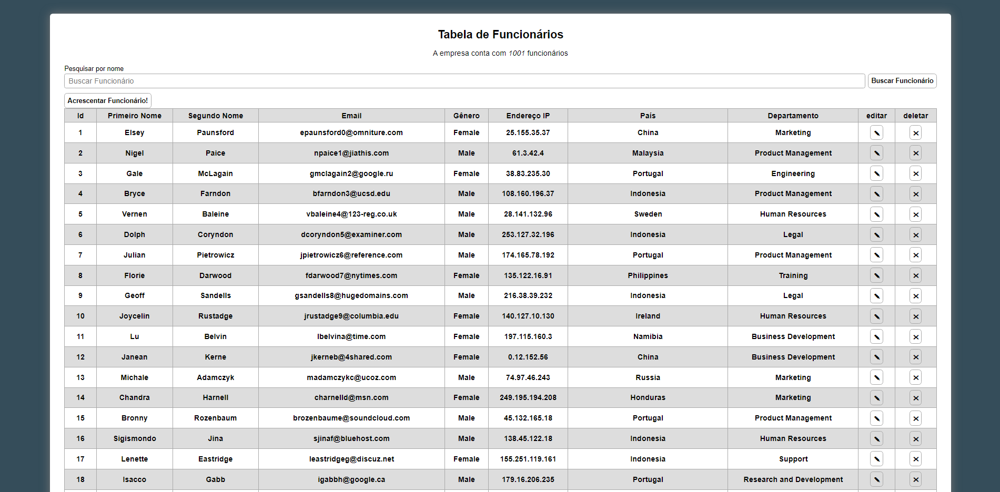

Empresa X - DS2M Site criado com objetivo didático para as aulas de Programação Back-end-web do curso Desenvolvimento de Sistemas do SENAI Jandira, sobre orientação dos professores Rafael e Cristiano.

O projeto consiste em trabalhar encima de um json, modificando os objetos excluindo eles, com funções e ações envolvendo também JavaScript.
O código foi construido pensando em boas práticas e funções puras.

 Aqui está o momento em que podemos edidar as caracteristicas do funcionário.

 
